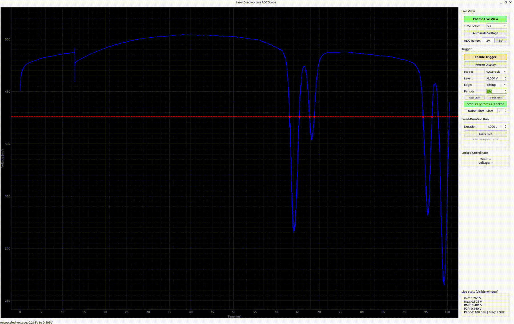
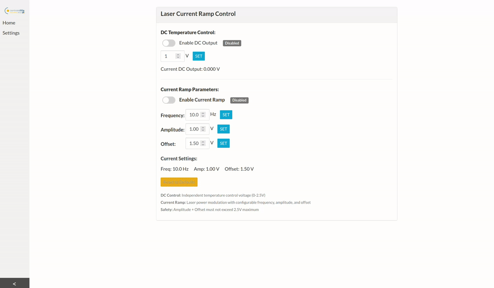
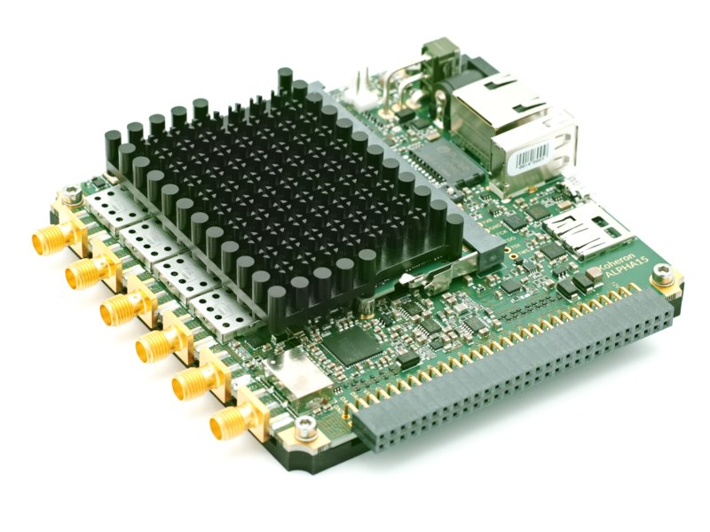
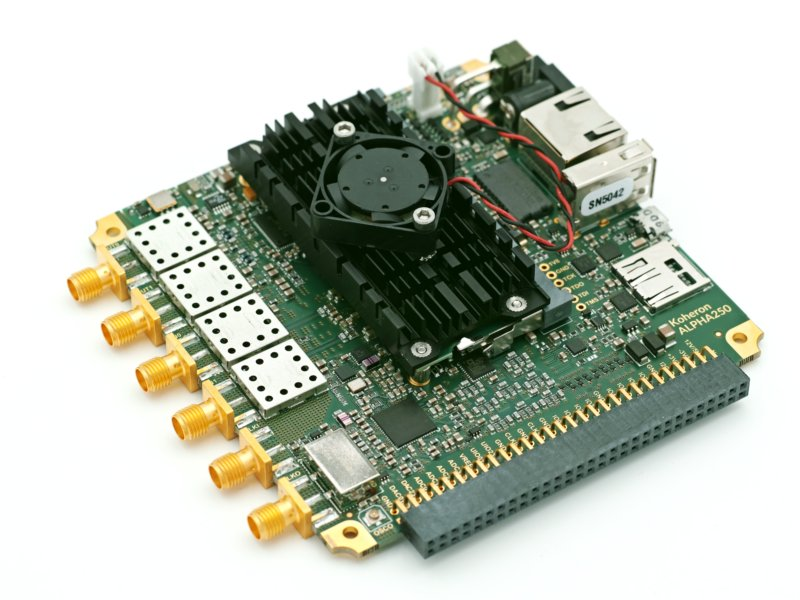

# FPGA Spectroscopy Driver

## Table of Contents:

- [Introduction](#introduction)
- [Live Demonstration & Results](#live-demonstration--results)
- [Technical Highlights](#technical-highlights)
    - [FPGA Hardware Design](#fpga-hardware-design)
    - [C++ Driver](#c-driver)
    - [PyQt and Web Applications](#pyqt-and-web-applications)
    - [Testing & Validation Infrastructure](#testing--validation-infrastructure)
- [Core Files & Modules](#core-files--modules)
    - [Koheron ALPHA15 Instrument](#koheron-alpha15-instrument)
    - [Koheron ALPHA250 Instrument](#koheron-alpha250-instrument)
- [Koheron Instrument](#koheron-instrument)
    - [Resources](#resources)
- [Setup](#setup)
- [Data Pipeline & Performance (ALPHA15)](#data-pipeline--performance-alpha15)
    - [Data Pipeline](#data-pipeline)
    - [Performance](#performance)
    - [Design Rationale](#design-rationale)

## Introduction:

This repository presents a **custom high-performance FPGA-based spectroscopy control and data acquisition system**, developed on the [Koheron ALPHA250 and ALPHA15](#koheron-instrument) platforms. The system integrates [custom FPGA modules](#fpga-hardware-design), [optimized C++ drivers](#c-driver), and [comprehensive Python and TypeScript applications](#pyqt-and-web-applications) to enable real-time, precision data acquisition, instrument control, and analysis for optical and spectroscopy research.  

My goal with this project was to deliver a robust, fully integrated platform that allows for complete customization of inputs and outputs, remote access and control from any device, and seamless extension for advanced research or industrial use. 

> The latest architecture uses the ALPHA15 board to leverage its 18-bit, low-noise ADCs and flexible signal processing chain. 

## Live Demonstration & Results:

To demonstrate the system’s capabilities, I performed a **complete cesium spectroscopy** experiment using only the ALPHA15 board, a Koheron amplifier, and a PID controller for temperature stabilization.  

This experiment provides validation that the full acquisition pipeline operates reliably in a lab environment. The FPGA hardware generates **precision voltage ramps**, **real-time trigger logic** consistently detects events, and the DMA and driver infrastructure sustain **high-speed data transfer**. Data is acquired and visualized live with zero missed triggers or dropped samples.  

> Here is a view of the PyQt app with the trigger enabled. (~10 seconds)

> Here is a view of the spectroscopy setup. The oscilloscope shows the hardware ramp being generated by the FPGA program. (~15 seconds)

> Here is a demonstration of the PyQt app. I begin by performing a "run" for 1 second. Then I autoscale the voltage. Next, I enable the trigger, modifying the period count and trigger threshold. Finally, I enable the live view, modifying the time scale. (~30 seconds)

> Here is a view of the web app to control the DC output and the hardware voltage ramp. (~10 seconds)

## Technical Highlights:
- ### FPGA Hardware Design:
    - Custom DDS-based Hardware Ramp Generator
        - Includes customizable timing control, with programmable frequency (up to 120 MHz), amplitude, and offset controls
    - High-Performance Continuous DMA Streaming
        - Complete DMA infrastructure using cirucular buffer management
        - Supports streaming rate up to 250 MSPS (ALPHA250), 15 MSPS (ALPHA15)
    - Signal Processing Pipeline
        - Implemented CIC decimation that allowed for configurable capture rates
        - Used a FIR compensation filter chain for noise reduction and anti-aliasing
- ### C++ Driver:
    - Memory-Mapped I/O Management
        - Advanced memory manangement for multiple address spaces including control, status, DMA, OCM, and more
    - Perforamnce Optimizations
        - Achieved 100x speedup through optimized data transfer and array retrieval to record billions of millions of datapoints
    - Hardware Abstraction:
        - Created a clean abstraction over Vivado Xilinx IP blocks
- ### PyQt and Web Applications:
    - Real-Time Oscilloscope and Live View:
        - Live ADC visualization with autoscaling time and voltage scales
    - Trigger System
        - Built multiple advanced trigger modes including peak, zero-cross, hysteresis, and edge-detection to handle complex spectoscopy graphs
        - Automatically detected periods with template matching for stable triggering views
    - Performance Optimizations:
        - Efficient circular buffer management and optimized plot updates, interacting with the C++ Driver and Vivado block design
    - TypeScript Web Application:
        - Allows for hardware ramp and temperature control from any device over Wi-Fi
        - Clean and professional interface with toggle switches and real-time status indicators
- ### Testing & Validation Infrastructure:
    - Developed 15+ Test Scripts covering performance, scaling, DMA streaming, timing validation, and hardware verification
    - Automated tests validating 100x+ performance improvements and sustained operation
    - Real-time DMA diagnostics, buffer monitoring, and error detection

 

## Core Files & Modules:

### **Koheron ALPHA15 Instrument**
- [Complete ALPHA15 Instrument](/alpha15-laser-control)
    - [C++ Driver](/alpha15-laser-control/laser-control.hpp)
    - [Vivado Zynq Block Design (TCL)](/alpha15-laser-control/block_design.tcl)
    - [Config File](/alpha15-laser-control/config.yml)
    - [PyQT App](/alpha15-laser-control/pyqt-app.py)
    - [Web app](/alpha15-laser-control/web)

### **Koheron ALPHA250 Instrument**
- [Complete ALPHA250 Instrument](/alpha250-laser-control)

## Koheron Instrument:

This project showcases a complete system built using Koheron FPGA instruments, known for their high-performance data acquisition and control capabilities in optics and signal processing applications. My work is built on top of Koheron’s open-source platform.

> *"The ALPHA15 is a programmable board built around a **Zynq 7020
> SoC**. It features **two 18-bit 15 Msps ADCs** with high dynamic range,
> low noise front-ends. The high input impedance (up to 1 MΩ) is
> easy to drive and allows to directly interface sensors. Two input
> ranges are selectionnable: 2 Vpp (± 1 V) or 8 Vpp (± 4 V). Thanks to
> the very low flicker noise corner frequency (below 50 Hz) the
> ALPHA15 excels in high oversampling applications. The ALPHA15
> also features a **dual-channel 16-bit 250 Msps low latency DAC** and
> a **4-channel 16-bit precision DAC**. The high speed data converters
> are clocked by a dual PLL, ultra-low jitter clock generator. The board
> comes with a comprehensive, open source, FPGA / Linux reference
> design."*

  
  

### Resources:

- [Koheron-SDK GitHub](https://github.com/Koheron/koheron-sdk)
- [ALPHA15 User Guide](https://www.koheron.com/support/user-guides/alpha15/)
- [ALPHA15 Data Sheet (PDF)](https://assets.koheron.com/datasheets/koheron_alpha15-18-bit-15-msps-acquisition-board.pdf)
- [ALPHA250 User Guide](https://www.koheron.com/support/user-guides/alpha250/)
- [ALPHA250 Data Sheet (PDF)](https://assets.koheron.com/datasheets/koheron_alpha250-signal-acquisition-generation.pdf)

## Data Pipeline & Performance (ALPHA15):

### Data Pipeline:
- **ADC:** LTC2387, 18-bit, 15 MHz, 8 Vpp input (16-bit, 250 MHz for ALPHA250)
- **FPGA:** CIC filter (programmable 100–5000× decimation), followed by FIR filter (2× decimation)
- **Output Rate:** 1.5 kHz – 75 kHz (configurable)
- **DMA System:** 16 MB circular buffer, 512 descriptors, 1024 samples/descriptor
- **Host Interface:** Ethernet streaming to Python/C++ drivers and application

---

### Performance:

| Stage         | Specification                          | Metric / Result               |
|---------------|----------------------------------------|------------------------------|
| **ADC**       | LTC2387 18-bit, 15 MHz                 | 122.6 dB SNR, 0.003 mV noise |
| **CIC Filter**| 100–5000× programmable decimation      | 0.0 ppm frequency accuracy   |
| **FIR Filter**| 2× fixed decimation, anti-aliasing     | Passband flattening, preserves SNR                             |
| **DMA**       | 16 MB buffer, 512 descriptors          | 99.8% utilization, 0 errors  |
| **Transfer**  | Ethernet, sustained                    | 2.44 MB/s                    |
| **Host**      | Python/C++ processing                  | 4.2% CPU overhead            |
> All performance metrics are gathered from [`alpha15-laser-control/performance.py`](./alpha15-laser-control/performance.py).

### Design Rationale:

**Decimation (CIC + FIR)**: Full-rate ADC sampling generates more data than is useful for typical spectroscopy and control tasks, overwhelming storage and bandwidth while adding unnecessary noise and overhead. On-FPGA decimation reduces the data rate to what the application actually needs, while preserving all relevant signal content and SNR. This allows the use of program on a wider array of devices, and enables smoother streaming over wireless connections.

**FIR Filter**: The FIR stage corrects passband droop from the CIC filter and provides final anti-aliasing.  

**Circular Buffer DMA**: A large, circular DMA buffer with scatter-gather support ensures continuous, real-time streaming without data loss, even during variable network or CPU loads.

**Configurable Output Rate**: The output rate is easily adjustable in hardware to match different application requirements, from high-resolution capture to minimal bandwidth modes.

## Setup:

I have provided a brief tutorial to set up an ALPHA250 or ALPHA15 device using this source code.

